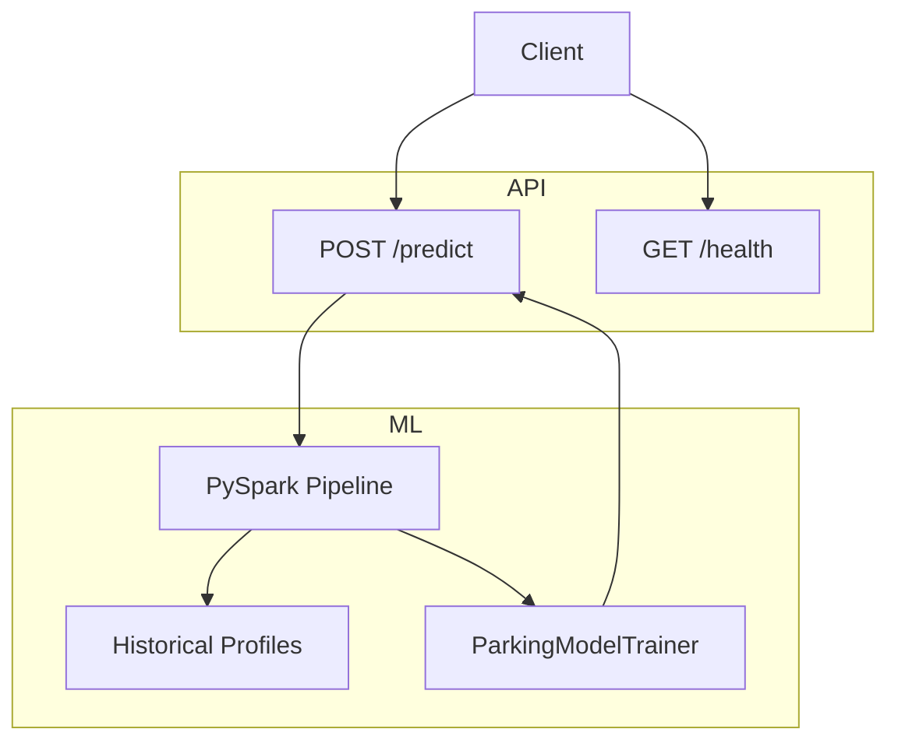

# 🚗 Smart Parking Assistant API

[](https://www.python.org/)
[](https://fastapi.tiangolo.com/)
[](https://spark.apache.org/)
[](https://pydantic.dev/)
[](https://www.uvicorn.org/)

A production-ready REST API for parking occupancy forecasting using FastAPI and PySpark. This repository demonstrates model training, inference, and lifecycle management for a smart parking assistant service.

---

## Overview

VW Smart Parking Assistant API provides:

- Real-time parking occupancy prediction for road segments
- A PySpark-based training pipeline using historical telemetry and weather data
- Adaptive alternative road segment recommendations for active and standard driver profiles
- Health and readiness monitoring endpoints

---

## Architecture




---

## Project Structure

- `api.py` — FastAPI application, lifecycle management, prediction endpoints, and model retraining orchestration
- `train_model.py` — Model training, feature assembly, prediction logic, and feature importance extraction
- `read_data.py` — Data ingestion, cleaning, filtering, and dataset consolidation
- `groundtruth.csv` — Parking telemetry ground-truth dataset
- `road_features.csv` — Road segment metadata and static attributes
- `weather_features.csv` — Weather observations merged into the training dataset
- `compose.yaml` — Container composition for local orchestration
- `Dockerfile` — Docker image definition for containerized deployment
- `requirements.txt` — Python dependency manifest
- `pyproject.toml` — Packaging metadata and tool configuration

---

## Installation

### Prerequisites

- Python 3.13+
- Java 11 or 17
- `pip` installed

### Python environment

```bash
python -m venv .venv
source .venv/Scripts/activate    # Windows
# or
source .venv/bin/activate       # macOS/Linux
pip install -r requirements.txt
```

### Optional: Docker

Build and run the container locally:

```bash
docker build -t vw-parking-assistant .
docker run --rm -p 5000:5000 vw-parking-assistant
```

---

## Running Locally
Save input files in the working directory

Start the API server with Uvicorn:

```bash
uvicorn api:APP --host 0.0.0.0 --port 5000
```

The service will initialize the Spark session, perform the first training pass, and begin serving requests.

---

## API Endpoints

### `GET /health`

Returns service health and model readiness.

Response model:

- `status`: `ok`
- `model_ready`: boolean
- `last_trained_at_utc`: timestamp or null

### `POST /predict`

Request body:

- `road_segment_id`: `string`
- `timestamp`: `datetime` (ISO-8601)
- `driver_profile`: `active | standard | inactive`

Response model:

- `road_segment_id`
- `timestamp`
- `driver_profile`
- `occupancy_probability`
- `top_alternatives` (optional list)

Example request:

```json
{
  "road_segment_id": "21976",
  "timestamp": "2026-07-03T08:30:00",
  "driver_profile": "active"
}
```

---

## Data Pipeline

1. `read_data.py` loads and cleans the CSV files
2. Datasets are joined using `road_segment_id` and `timestamp`
3. `train_model.py` prepares features, computes target-encoded historical ratios, and trains a RandomForest pipeline
4. `api.py` caches the trained model and serves inference requests
5. A background retraining thread refreshes the model hourly

---

## Notes
- The API expects complete data and drops rows containing null values during ingestion.
- Historical occupancy ratios are computed from the training set and filled with `0.5` when data is missing during inference.
- The initial startup may take time because Spark initialization and model training occur before the server becomes ready.

---
